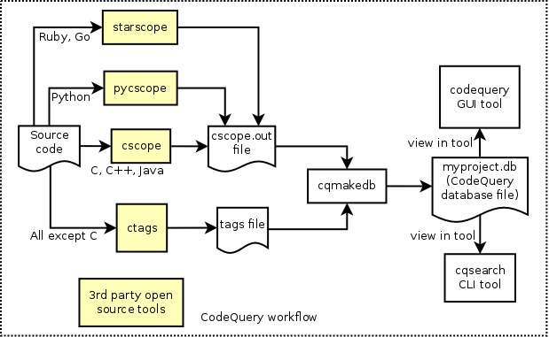

CodeQuery
=========

This is a tool to index, then query or search C, C++ and Java source code (and probably also C#).

It builds upon the databases of [cscope](http://cscope.sourceforge.net/) and [Exuberant ctags](http://ctags.sourceforge.net/).

The databases of *cscope* and *ctags* would be processed by the *cqmakedb* tool to generate the CodeQuery database file.

The CodeQuery database file can be viewed and queried using the *codequery* GUI tool.

## Latest version = v0.03

For Windows, v0.03 available here for download: [CodeQuery@sourceforge downloads](https://sourceforge.net/projects/codequery/files/)

For Linux, please read the [INSTALL-LINUX](doc/INSTALL-LINUX.md) file. The latest git version (HEAD on master branch) can be used.

Please read [NEWS](NEWS.txt) to find out more.

## How is it different from cscope and ctags? What are the advantages?

Both cscope and ctags can do symbol lookup and identify functions, macros, classes and structs.

cscope is very C-centric, but is fuzzy enough to cover C++ and Java, but not very well for e.g. it doesn't understand destructors and class member instantiations. It can't provide relationships of class inheritance and membership. cscope can do "functions that call this function" and "functions called by this function". This is a very powerful feature that makes cscope stand out among comparable tools.

ctags does many languages well and understands destructors, member instantiations, and the relationships of class membership and inheritance. From ctags, we can find out "members and methods of this class", "class which owns this member or method", "parent of this class", "child of this class" etc. However, it doesn't do "functions that call this function" or "functions called by this function".

So both these tools have their pros and cons, but complement each other.

CodeQuery is a project that attempts to combine the features available from both cscope and ctags, provide faster database access compared to cscope (because it uses sqlite) and provides a nice GUI tool as well.

* Combines the best of both cscope and ctags
* Faster due to the use of sqlite for the CodeQuery database
* Cross-platform GUI tool
* Fast auto-completion of search term
* Case-insensitive, partial keyword search - wildcard search supported * and ?
* Exact match search
* File viewer with syntax highlighting
* Ability to open viewed file in an external editor or IDE.

## What types of query can I make?

* Symbol
* Function or macro
* Class or struct
* Functions calling this function
* Functions called by this function
* Class which owns this member or method
* Members and methods of this class
* Parent of this class (inheritance)
* Children of this class (inheritance)
* Files including this file
* Full path for file

## What does it cost? How is it licensed?

It's freeware and free open source software.

This software is licensed under the [GNU GPL v3](http://www.gnu.org/licenses/gpl.html). See [LICENSE.md](LICENSE.md) or [LICENSE.txt](windows-install/LICENSE.txt).

Files under the `querylib` directory are licensed under the [MIT license](http://opensource.org/licenses/MIT). See [QueryLib README](querylib/README.txt). This is a library to query CodeQuery database files. This library is MIT-licensed, so that it may be used to create plugins for editors, IDEs and other software without license restrictions. It's only dependency is on sqlite3.

## Can I use it in a commercial environment without purchasing, for an unlimited time?

Yes. However, donations are welcomed.

## Which platforms are supported?

It has been tested on Ubuntu 32-bit, Windows XP and Windows 7.

Contributions are welcomed to attempt ports to Mac OS and other operating systems.

## Is the software available in multiple languages?

Yes. This applies only to the GUI tool.

Contributions are welcomed to update or provide new translations.

## How to install it?

On Windows, EXE setup packages will be provided here: [CodeQuery@sourceforge downloads](https://sourceforge.net/projects/codequery/files/). The EXE setup package shall also contain cscope.exe, ctags.exe and the required DLLs. So, everything you need is in one package.

On Linux, please read the [INSTALL-LINUX](doc/INSTALL-LINUX.md) file.

## How do I use it?

Please read the HOWTO file provided for each platform. The workflow looks like this:

On Linux: [HOWTO-LINUX](doc/HOWTO-LINUX.md)

On Windows: [HOWTO-WINDOWS](windows-install/HOWTO-WINDOWS.txt)

## How do I contact the authors for support, issues, bug reports, fix patches etc.?

Please see the email address below, and also the Issues tab in GitHub.

Email address: 

Website: [CodeQuery website](https://github.com/ruben2020/codequery)

## List of Contributors

ruben2020   
(More welcomed)

## What does it look like?

## What future features are planned?

* Visualization of call graphs and class inheritance

## Credits

A big thank you to the people behind the following projects:    
[cscope](http://cscope.sourceforge.net/)   
[Exuberant ctags](http://ctags.sourceforge.net/)   
[sqlite3](http://www.sqlite.org/)   
[CMake](http://www.cmake.org/)   
[Qt open source](http://qt-project.org/)   
[optlist](http://michael.dipperstein.com/optlist/index.html)   

